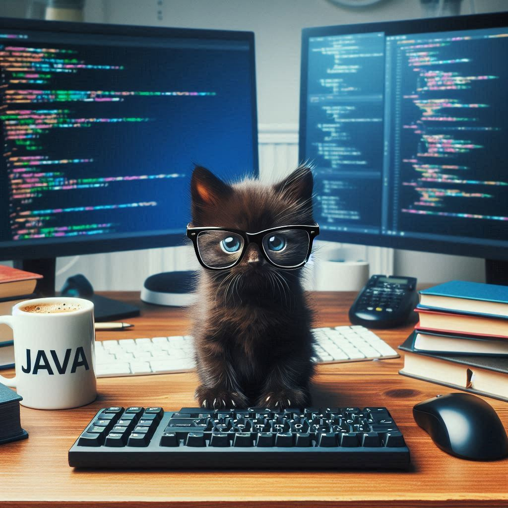
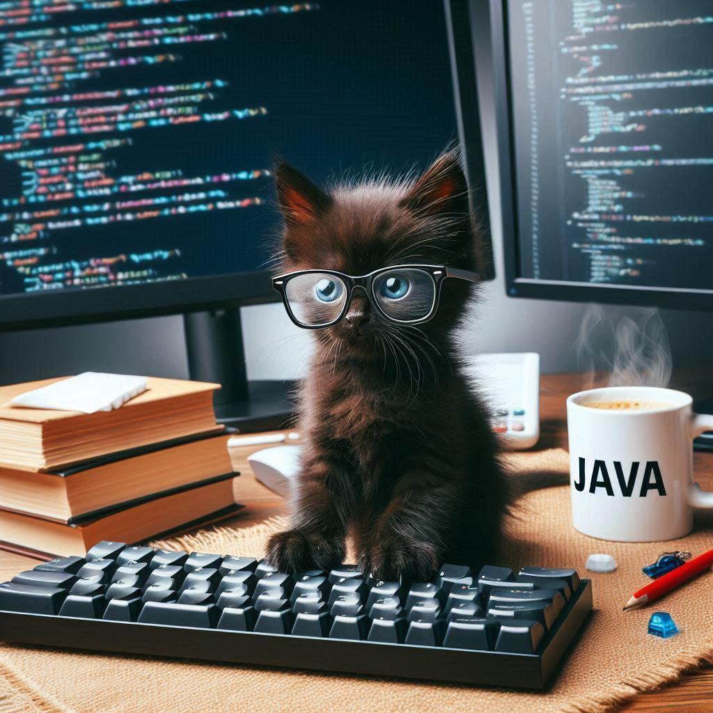
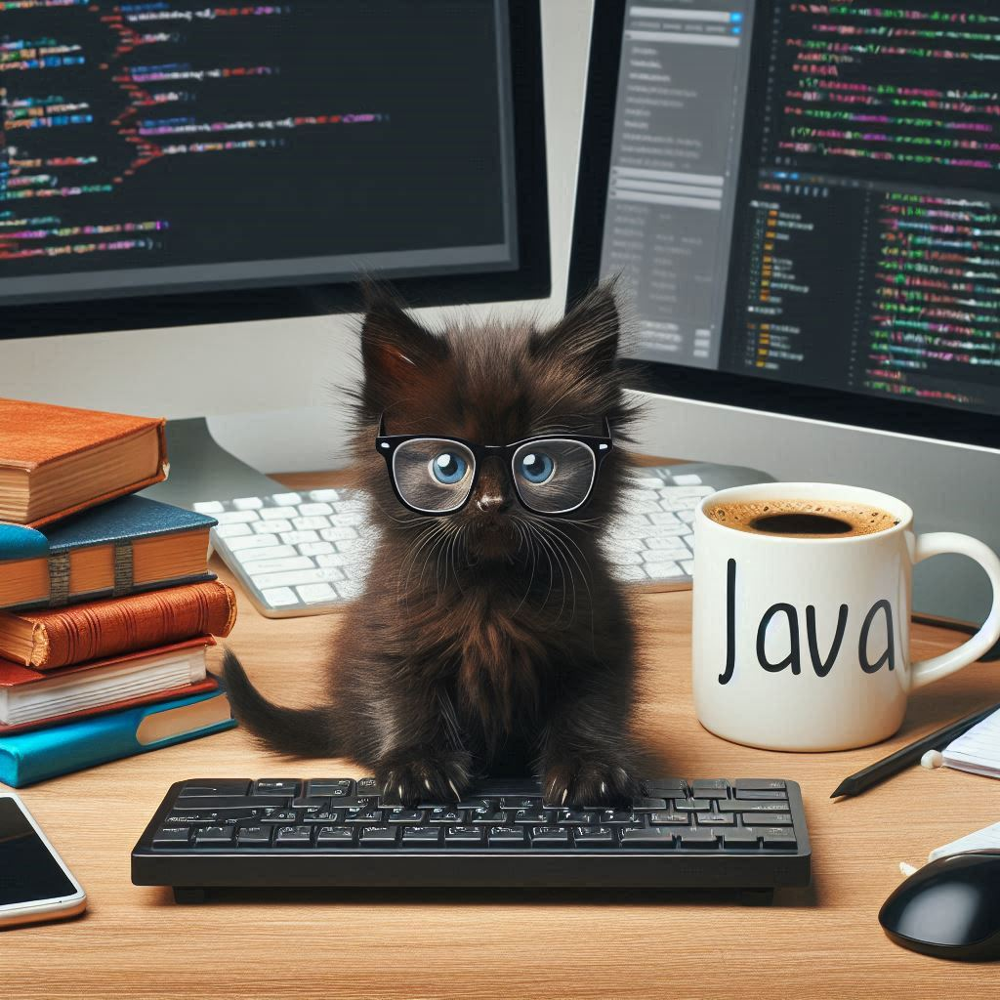
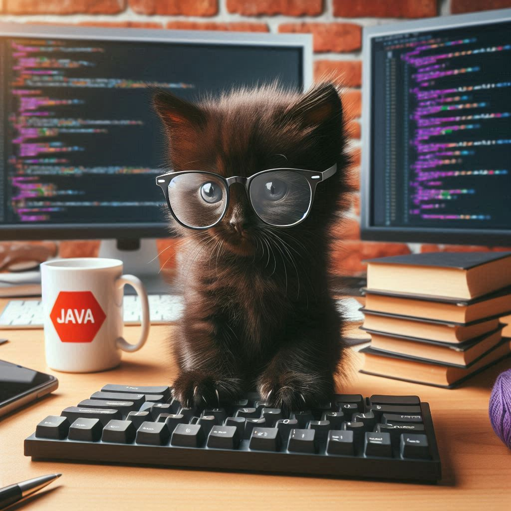
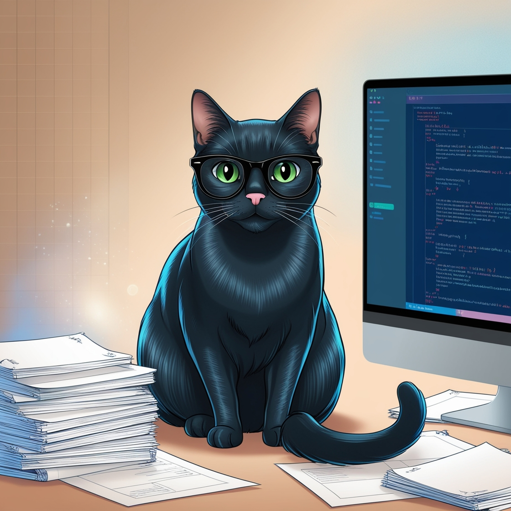
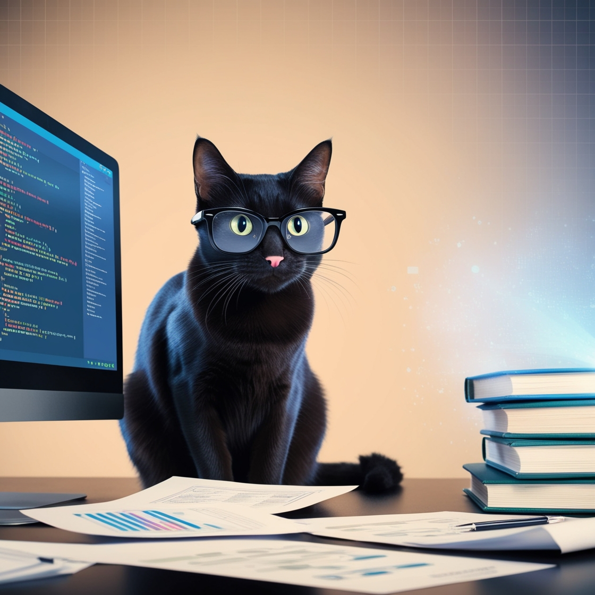
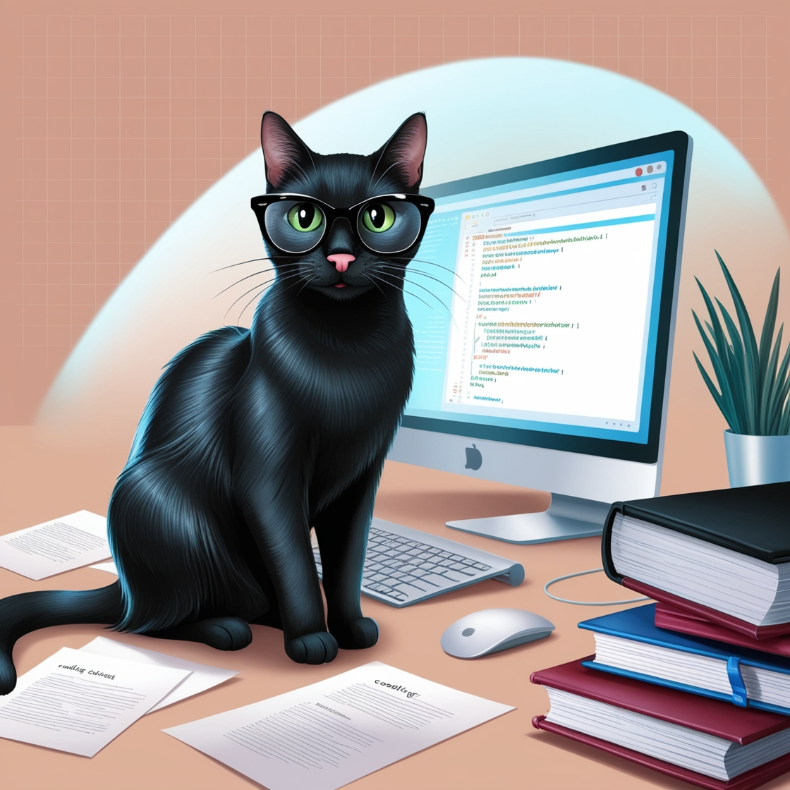
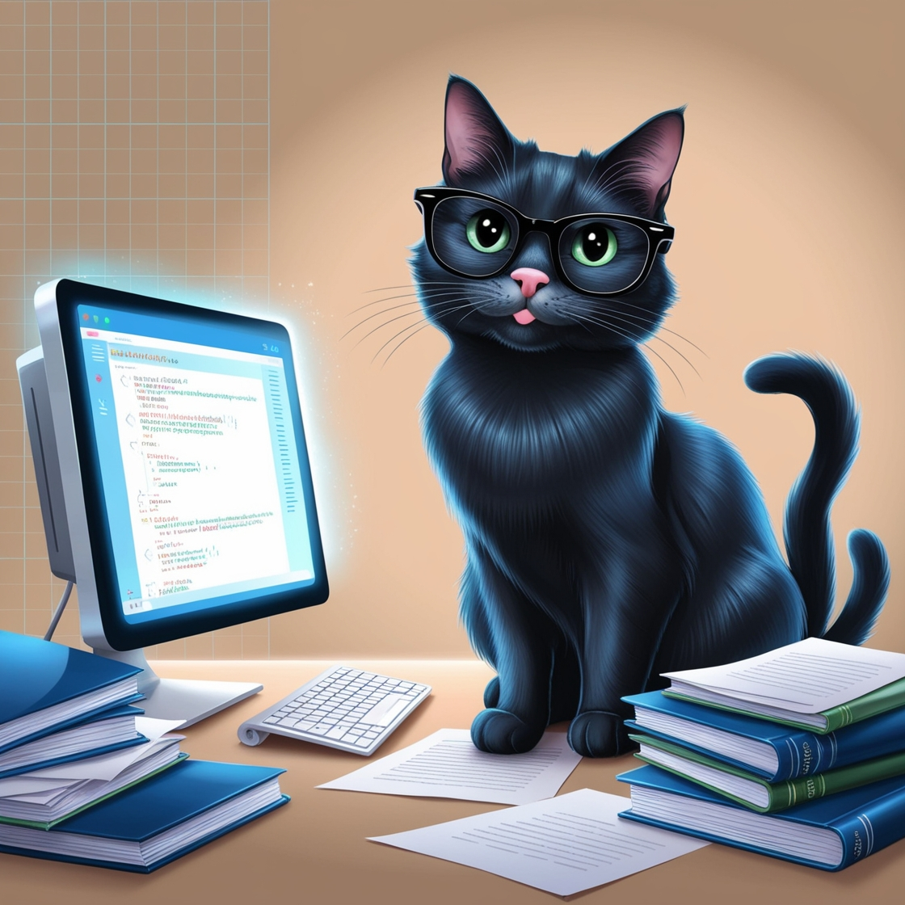

# Título do Projeto Extremamente Aesthetic ;)

## 📒 Descrição
Resolvi usar a imaginação e criar imagens com o uso de de IA's.

## 🤖 Tecnologias Utilizadas
<a href="https://www.bing.com/images/create?FORM=IRPGEN"> <strong>Microsoft Bing image creator</strong> </a> 
<a href="https://app.leonardo.ai/"> <strong>Leonard.Ai</strong> </a>

## 🧐 Processo de Criação
Nas duas IAs solicitei a imagem de um gatinho preto programador.

## 🚀 Resultados
Recebi 4 imagens para escolher

#### Geradas pelo Bing

 

 

#### Geradas pelo Leonard.Ai

 

## 💭 Reflexão (Opcional)
As Inteligencias artificiais são ferramentas que podem gerar infinitas possibilidades.

